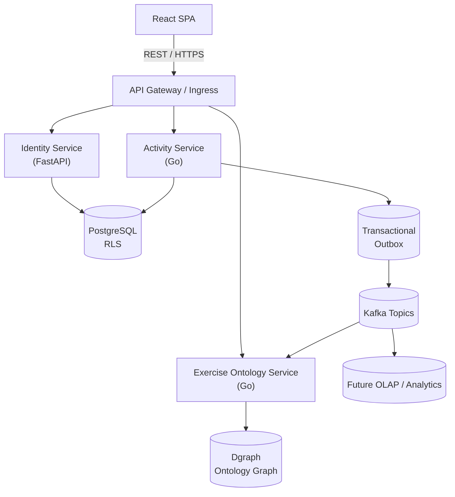
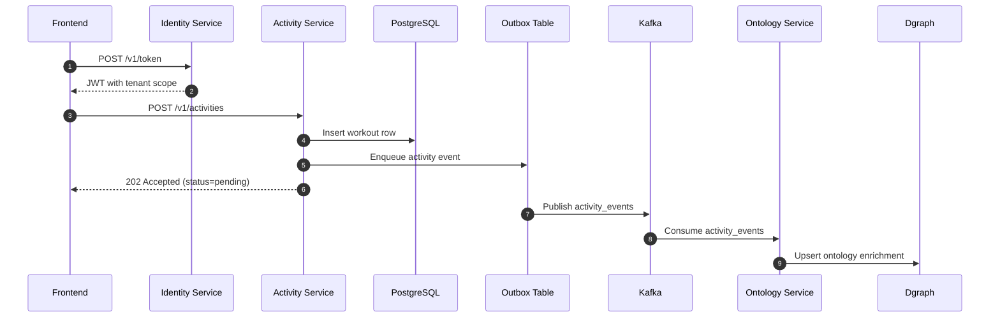

# Fitness & Wellness Activity Tracker — High-Level Design (Markdown)

## 1. Overview
A modern **fitness and wellness tracker** that enables users to log, monitor, and analyze their health activities with a lightweight identity layer and an exercise knowledge graph. The initial delivery focuses on three bounded-context microservices that satisfy the multi-language requirement while keeping the footprint intentional.

### Key Technologies
| Layer | Technology |
|--------|-------------|
| Frontend | React |
| Backend | Go (Golang) for Activity & Ontology, Python (FastAPI) for Identity |
| Relational DB | PostgreSQL (OLTP) |
| Graph DB | Dgraph |
| Messaging | Kafka |
| API | RESTful |
| Persistence | Dual-write: PostgreSQL & Dgraph |

### Core Constraints
- Maintain **data consistency** between OLTP and OLAP layers for all published messages.
- **Optimistic updates** in frontend with visible pending state.
- **Graceful failure handling** with retries, fallbacks, and user transparency.

---

## 2. Architecture Summary

- **PostgreSQL** stores transactional identity and activity data with row-level security.
- **Dgraph** stores exercise taxonomy, movement relationships, and recommendation edges surfaced by the Ontology service.
- **Kafka** handles asynchronous event propagation between the Activity service and downstream consumers.
- **Outbox pattern** in the Activity service ensures atomicity between OLTP writes and event publication.
- **Identity & Account service** issues scoped tokens and manages tenant-aware account metadata consumed by the other services.

---

## 3. System Components

### 3.1 Frontend (React)
- Implements optimistic updates for instant UX feedback.
- Shows clear **pending indicators** when actions are processing.
- Uses **React Query / Zustand** for cache and state management.
- Retries transient failures with exponential backoff.

### 3.2 Backend Services
| Service | Language | Responsibility |
|----------|----------|----------------|
| Identity & Account | Python (FastAPI) | Authentication, account lifecycle, tenant isolation, token issuance |
| Activity | Go | Workout ingestion, transactional source of truth, outbox to Kafka |
| Exercise Ontology & Search | Go | Exercise taxonomy CRUD, knowledge graph traversal, keyword/tag search |

---

## 4. Data Persistence

### PostgreSQL (Relational OLTP)
- Tables: `accounts`, `sessions`, `activities`, `goals`, `outbox`
- ACID transactions guarantee data correctness.
- **Transactional Outbox** pattern used for event publishing.

### Dgraph (Graph OLTP)
- Nodes: Exercise, MuscleGroup, Equipment, Goal
- Edges: TARGETS, REQUIRES, CONTRAINDICATED_WITH, COMPLEMENTARY_TO
- Stores ontology relationships for quick traversal, personalization, and recommendation queries driven by the Exercise Ontology service.

#### 4.2.1 Technology Choice Rationale and Risks
The selection of Dgraph is based on its horizontal scalability and native GraphQL integration, which aligns with our long-term vision for rich exercise knowledge navigation. However, we acknowledge that Dgraph is a less mature technology than some alternatives (e.g., Neo4j), which presents risks related to the size of the developer community and the availability of third-party tools. To mitigate these risks, we will invest in targeted training for the development team and allocate resources for building in-house expertise and custom tooling where necessary. The limited scope (one service) lowers overall blast radius.

### OLAP Layer (Analytical)
- Downstream data warehouse fed by Kafka CDC streams.
- Supports aggregate queries and long-term analytics.

The analytical layer must support high-volume data ingestion and complex ad-hoc queries with low latency. Key requirements include:
- **Scalability:** Ability to scale horizontally to handle growing data volumes.
- **Performance:** Fast query performance for interactive dashboards and complex analytical queries.
- **Integration:** Seamless integration with the existing data pipeline (Kafka) and business intelligence tools.

The following technologies are under consideration:
- **ClickHouse:** An open-source columnar database known for its exceptional query performance.
- **Snowflake:** A cloud-native data platform that offers a fully managed solution with excellent scalability.
- **BigQuery:** Google's serverless data warehouse that provides a highly scalable and cost-effective solution.

A final decision will be made after a proof-of-concept (POC) that evaluates each technology against our specific workload and performance requirements.

---

## 5. Data Flow & Consistency
0. Frontend exchanges credentials for a tenant-scoped token via the Identity service.
1. Frontend submits a new activity with that token → Activity service validates scope and processes request.
2. Activity service writes to **PostgreSQL** in a transaction and records an event in `outbox`.
3. Outbox relay publishes to **Kafka**.
4. Kafka consumers (Exercise Ontology service, analytics loaders) update **Dgraph** or downstream stores as needed.
5. Once sinks acknowledge, event marked **published** and `ActivityStateChanged` emitted for UI parity.

Ensures **atomic write + eventual consistency** across stores.

### 5.1 Outbox Pattern Considerations
While the transactional outbox pattern provides a strong guarantee of atomicity, it introduces operational complexity. The outbox consumer becomes a critical component that requires robust monitoring and alerting on its processing lag, the size of the `outbox` table, and the Dead Letter Queue (DLQ) depth. A well-defined strategy for handling DLQ messages, including automated retries with exponential backoff and a clear process for manual intervention, is essential to prevent data drift between PostgreSQL and Dgraph.

### 5.2 Event Propagation Sequence

---

## 6. Messaging & Events (Kafka)
- Topics: `activity_events`, `activity_state_changed`, `ontology_updates`.
- Exactly-once semantics with idempotent producers.
- DLQ (Dead Letter Queue) for unrecoverable messages.

---

## 7. API Layer
RESTful endpoints with JSON responses.
- `POST /v1/activities`
- `GET /v1/activities/{id}`
- `GET /v1/users/{id}/activities`
- `PATCH /v1/goals/{id}`

Supports **idempotency keys**, **pagination**, and **RFC7807 error format**.

---

## 8. Failure & Recovery
- **Retry policies** with exponential backoff.
- **Circuit breakers** and **graceful degradation** in case of partial service outage.
- Outbox workers use **deduplication** to avoid reprocessing.
- UI displays retry options and clear error messages.

---

## 9. Observability
- Distributed tracing via **OpenTelemetry**.
- Metrics: write latency, outbox lag, Kafka throughput.
- Alerts: Dgraph mutation failure, OLAP sync lag.
- SLOs: 99.9% uptime, <5min OLTP→OLAP parity, <1s read latency.

---

## 10. Security & Privacy
- Authentication via **OIDC**.
- Role-based authorization (JWT scopes).
- Encryption: TLS 1.3 in transit, KMS at rest.
- Row-level security for multi-tenant isolation.

### 10.1 Multi-Tenancy and Data Isolation
Data isolation between tenants will be enforced using row-level security (RLS) policies in PostgreSQL and attribute-based access control in Dgraph. Application-level checks will be implemented to ensure that users can only access data they are authorized to view. The implementation of RLS will be carefully monitored for any potential performance impact on query execution.

---

## 11. Deployment
- **Containerized** with Docker & Kubernetes.
- Managed PostgreSQL, Dgraph, and Kafka clusters.
- Blue/Green deployments for backend.
- CI/CD pipeline with schema migrations and automated tests.

---

## 12. Key Design Advantages
- Strong data integrity with minimal coupling.
- Fast, reactive user experience backed by optimistic UI and state-change events.
- Right-sized service surface: three clearly defined domains that still demonstrate multi-language integrations.
- Scalable horizontally at each layer.

---

## 13. Open Decisions
- Evaluate if GraphQL gateway should supplement REST for aggregation across Identity, Activity, and Ontology.
- Define long-term PII retention and redaction policy.

---

**Outcome:** A fault-tolerant, user-friendly fitness tracker platform that bridges transactional and graph domains with verifiable data consistency and seamless frontend experience.
